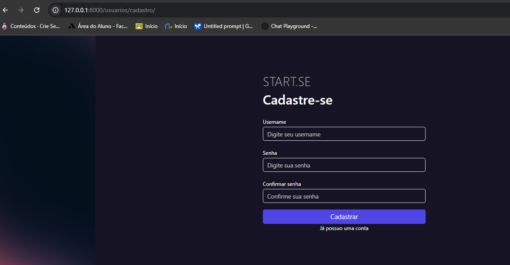
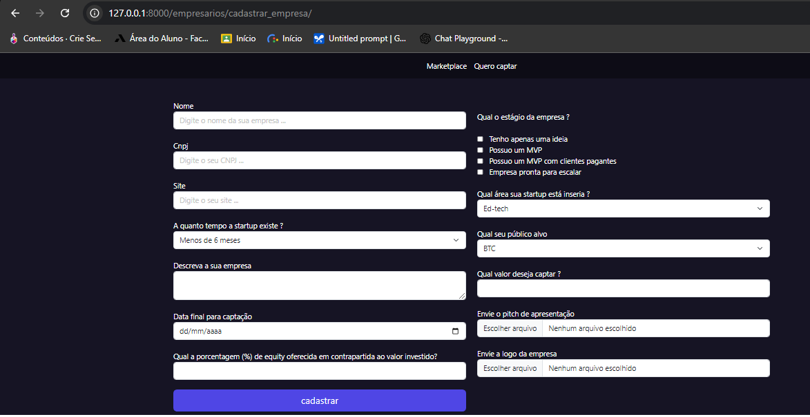
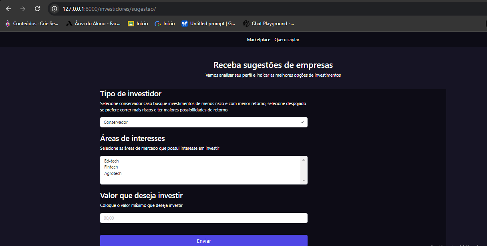

# Pystack Week 11
O evento Pystack Week 11 da Pythonando apresenta um evento sobre otimização e boas práticas no desenvolvimento de aplicações com Python e Django.

## Foco do Projeto

### Cadastro e Login de Usuários

- **Cadastro de Usuários**: O sistema inclui uma funcionalidade para que os usuários se registrem e criem contas.
- **Login de Usuários**: Os usuários podem fazer login para acessar o sistema e gerenciar suas empresas e investimentos.



### Cadastro de Empresas

- **Gerenciamento de Empresas**: O sistema permite que os usuários cadastrem e gerenciem informações sobre diferentes empresas.
- **Informações Básicas**: Dados como nome da empresa, setor de atuação e outros detalhes relevantes são armazenados.



### Investimentos Entre Empresas

- **Registro de Investimentos**: As empresas podem registrar seus investimentos uns nos outros, estabelecendo uma relação financeira entre elas.
- **Relacionamento de Investimentos**: O sistema gerencia e visualiza como os investimentos são feitos e monitorados entre as empresas.



### Objetivo do Sistema

- **Simular um Ambiente de Negócios**: O projeto simula um ambiente onde empresas interagem financeiramente, oferecendo uma visão prática de como implementar e otimizar um sistema com essas características.
- **Otimização e Performance**: Aplicar técnicas de otimização para melhorar a performance do Django, focando na eficiência na gestão de dados e na execução de operações.

## Bibliotecas:

- **Django:** É um framework web de alto nível para a linguagem Python que facilita o desenvolvimento rápido de aplicações web seguras e escaláveis. Ele é conhecido por sua simplicidade e "batteries-included" (tudo incluso), oferecendo uma ampla gama de funcionalidades prontas para uso, o que permite que os desenvolvedores se concentrem na construção de suas aplicações sem se preocupar com tarefas comuns e repetitivas.

- **Pillow:** É uma biblioteca Python para processamento de imagens. Ela é uma bifurcação da biblioteca PIL (Python Imaging Library) e oferece uma ampla gama de funcionalidades para abrir, manipular e salvar arquivos de imagem em diferentes formatos.

## Configurações: 
- Para Instalar as bibliotecas mencionadas basta rodar o seguinte código no terminal:
    ```bash
    pip install django
    pip install pillow

## Extensões VS Code:
- **Python:** Fornece suporte completo para desenvolvimento em Python.

- **Django:** A extensão Django para VS Code oferece suporte especializado para o desenvolvimento com o framework Django, facilitando a escrita e a manutenção do código. Ela inclui recursos como snippets de código para agilizar a escrita de views e modelos, realce de sintaxe específico para arquivos e templates Django, e ferramentas de navegação para localizar rapidamente arquivos e funções. Além disso, a extensão integra comandos do Django no terminal do VS Code e oferece sugestões e autocompletar para melhorar a eficiência no desenvolvimento. Esses recursos ajudam a tornar o trabalho com Django mais rápido e produtivo.


- **SQLite Viewer:** A extensão SQLite Viewer para VS Code permite visualizar e interagir com bancos de dados SQLite diretamente no editor. Ela oferece uma interface gráfica para explorar tabelas, consultar dados e executar comandos SQL, facilitando o gerenciamento de bancos de dados SQLite sem sair do ambiente de desenvolvimento. Com essa extensão, você pode inspecionar e modificar dados, bem como analisar a estrutura do banco de dados de forma prática e eficiente.